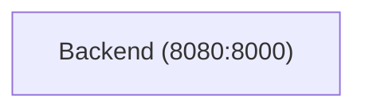

# Grey Matter

## Peek Inside the Black Box: Keep Track of Tokens, RAG, and Tools Behind Every LLM Response

The goal of this project is to better visualize the context window in an LLM chatbot and explore the concepts of short-term and long-term memory.

## Architecture

Here what the current infrastructure looks like.

